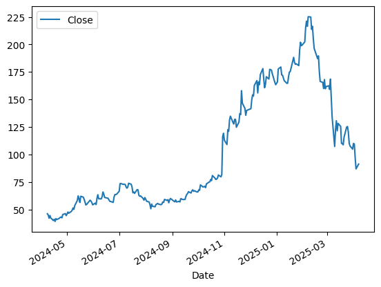

# Stock-Data

RDDT Time Series Analysis

## Table of Contents

1. [Introduction](#introduction)
2. [Data](#data)
3. [Process Outline](#process-outline)
   1. [Initial Observation/Clean](#clean-data)
   2. [Analyze Data](#analyze-data)
   3. [Preprocess Data for Model](#preprocess-data-for-model)
   4. [Model Analysis/Prediction](#model-prediction/analysis)
4. [Next Steps](#next-steps)
5. [References](#references)

## 1 - Introduction 

I made predictions on Reddit (RDDT) stock using time series analysis. I used root mean squared error (RMSE) as the metric for success. RMSE gives the avergae size of prediction errors (i.e higher number means predicitons were further away from actual prices) so I was looking for a model that gave the lowest RMSE.

## 2 - Data 

I used the last year (251 trading days) of Reddit's daily closing stock prices for my analysis. I pulled my data using the YFinance Python library.

## 3 - Process Outline 

### 3i - Initial Observations/Clean 

### 3ii - Analyze Data 

### 3iii - Preprocess Data for Model 

### 3iv - Model Analysis/Prediction 

## 4 - Next Steps 

## References 

\\
